# Canvas Daily

An early-warning layer on top of [Canvas LMS](https://www.instructure.com/canvas). One person can connect many Canvas accounts — their own and their kids', across different institutions — and receive **one** correct, correctly-labeled daily report: Past due, Due today, Upcoming. Every item links to an instant, app-rendered detail page that can generate an AI study breakdown on demand.

It does **not** replace Canvas. Work is still done and submitted in Canvas — Canvas Daily just makes sure nothing slips by unseen.

## How it works

- One user owns many Canvas **connections** (each with its own institution base URL and access token).
- A **daily job** fetches and stores full assignment detail for every connection.
- A grouped **daily email** merges everything into one report, sorted by due date and labeled by connection.
- Each item links to a **detail page** rendered instantly from stored data — no live Canvas call on click.
- On any detail page, one button generates an **AI study breakdown** of that assignment.

## Two APIs

| API | Role |
| --- | --- |
| **Canvas LMS** | Pulls the raw assignment data per connection. |
| **Groq / Llama 3.3 70B** | Turns a single assignment into an actionable study plan, on demand. |

The detail page is where they meet: stored Canvas detail on the page, one button for the AI breakdown.

## Stack

- **FastAPI** — setup screens, report, detail pages, AI endpoint
- **SQLModel** — ORM over **Neon** (Postgres)
- **Jinja2** — server-rendered templates
- **Groq** via the OpenAI-compatible API — `base_url = https://api.groq.com/openai/v1`, model `llama-3.3-70b-versatile`
- **pytest** — test runner
- **cron** — daily job · **SMTP** — email delivery

One language, one test runner, one deploy.

## Data model

One-to-many: a **user** owns many **connections**; each connection owns many stored **assignments**.

- **User** — id, email, password hash, created_at
- **Connection** — id, user_id, label, base_url, account_type (`student` | `observer`), access_token (encrypted at rest), created_at
- **Assignment** — id, connection_id, canvas_assignment_id, name, description (sanitized HTML), due_at, points_possible, submission_types, html_url, workflow_state, score (nullable), submitted_at (nullable), late, missing, excused, fetched_at

## The AI study breakdown

On-demand, not pre-fetched. When the user presses the button, the endpoint assembles the assignment's title, description, points, due date, and course into a context block (missing fields dropped, not sent blank) and asks Groq for a fixed four-section markdown response:

1. **What's being asked**
2. **Step-by-step plan**
3. **Watch out for**
4. **Time estimate**

Capped under ~300 words, temperature `0.5`. A timeout returns a clear "took too long" message; any other failure returns a clean error — never a broken page.

## Built test-first

TDD throughout — red, green, refactor — layered inside-out:

1. **Pure functions** — date/bucketing helpers. Known in, known out, no mocks.
2. **Canvas fetch** — Canvas mocked. Pagination, `include[]=submission` parsing, sanitization, null scores.
3. **AI breakdown** — Groq mocked. Context assembly, four-section output, timeout → 504, no key in logs.
4. **ORM integration** — real Neon test branch. One-to-many model, round-trip, report query.
5. **End-to-end** — sign up, add connection, view report, click into detail, generate breakdown.
6. **Daily sync** — Canvas mocked. Per-connection course walk, store full detail, upsert (no duplicates), one path for one connection or many.
7. **Daily email** — SMTP mocked. One message per user, grouped/sorted/labeled by connection, no token in the body.

### Test evidence

Each layer is documented with a captured pytest run — the failing red before the code exists, the passing green after. Images live in [`docs/test-evidence/`](docs/test-evidence/).

**Layer 1 — date bucketing**

Red — the function stubbed, logic not yet written:

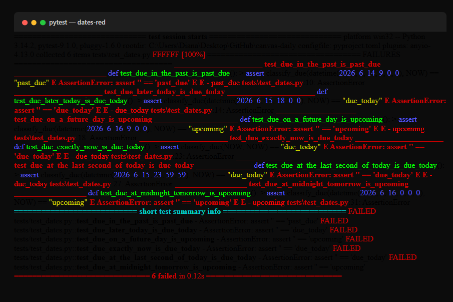

Green — after writing `classify_due`:

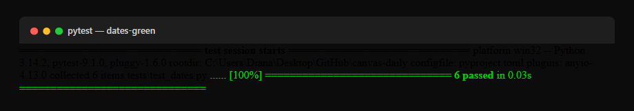

**Layer 2 — Canvas fetch (Canvas mocked at the httpx transport)**

Red — the five behaviors written against an empty stub: pagination, `include[]=submission` parsing, HTML sanitization, null-score preservation, core field parsing:

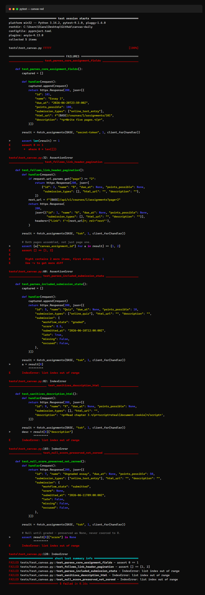

Green — after writing `fetch_assignments` (and a later regression test normalizing Canvas `...Z` timestamps to naive UTC — six tests):

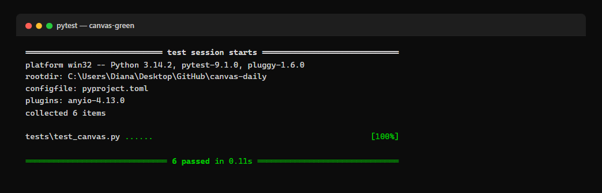

**Layer 3 — AI breakdown (Groq mocked at the httpx transport)**

Red — eight behaviors written against an empty stub: context assembly, dropping missing fields, the four-section system prompt, returning markdown, timeout → 504, clean non-timeout error, and no API key in any log line:

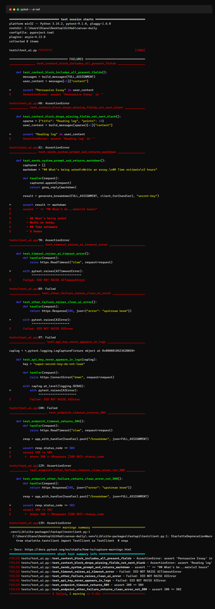

Green — after writing `generate_breakdown` and the `/breakdown` endpoint:

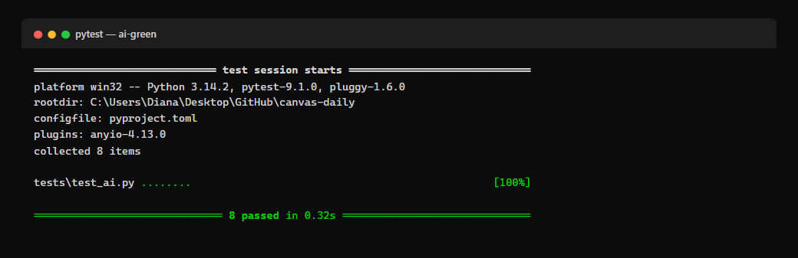

**Layer 4 — ORM integration (real Neon test branch)**

These run against a live Postgres branch, so they need `TEST_DATABASE_URL` set in `.env` (and skip cleanly without it). Six behaviors: a user owns many connections, a connection owns many assignments, deleting a connection cascades to its assignments, stored detail round-trips field-for-field, the access token is **encrypted at rest** (raw column is ciphertext), and the report query groups by status and sorts by due date.

Red — the ORM modules don't exist yet (an honest feature-missing red rather than a faked stub schema):

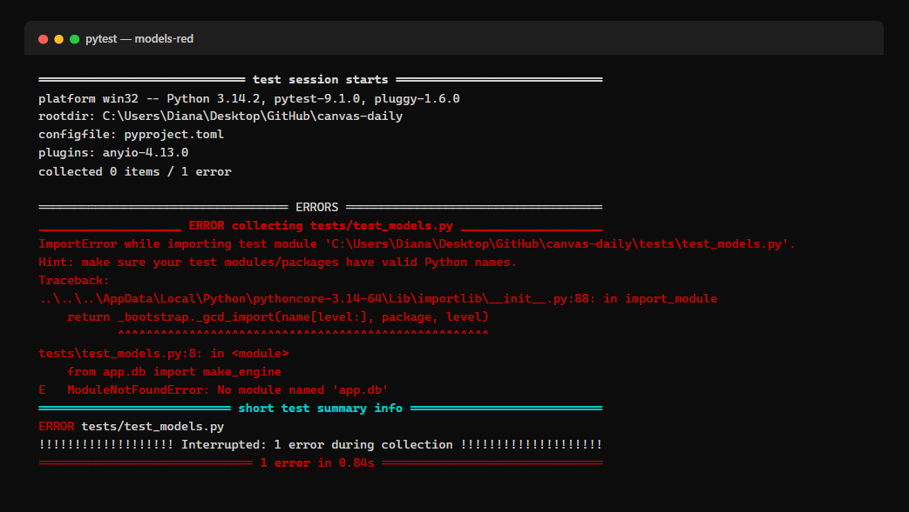

Green — after writing the models, engine, encrypted-token column, and report query:


**Layer 5 — end-to-end (the full user flow)**

Drives the whole product: sign up, log in, add a connection, view the grouped report, open a stored detail page, and press "Break this down" for the AI breakdown. Plus two guardrails — the detail page renders from stored data with **no live Canvas call**, and a logged-out user is **blocked from the report** (and from another user's assignment). Runs against the Neon test branch; skips in CI without it.

Red — the web app and auth module don't exist yet:

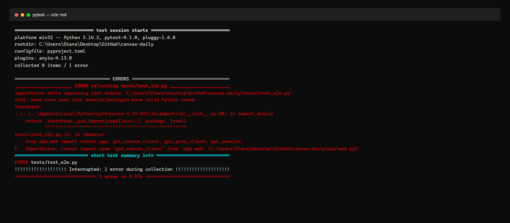

Green — after writing the FastAPI app, auth, sessions, and the Jinja2 pages:


**Layer 6 — daily sync job (Canvas mocked, stored to the Neon test branch)**

The pre-fetch that fills storage: for every connection, list its active courses, fetch each course's assignments, and store full detail — so detail pages later read from storage with no live call. Four behaviors: course pagination, storing across a connection's courses, idempotent **upsert** (re-runs update, never duplicate), and one path that covers one connection or many.

Red — the sync module and `fetch_courses` don't exist yet:

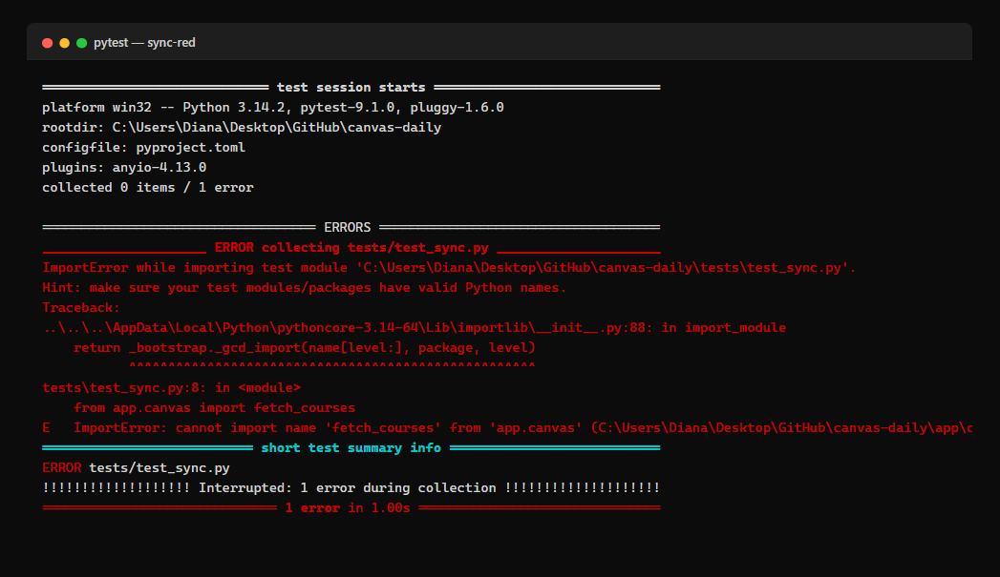

Green — after writing `fetch_courses`, `sync_connection`, and `run_daily_sync`:

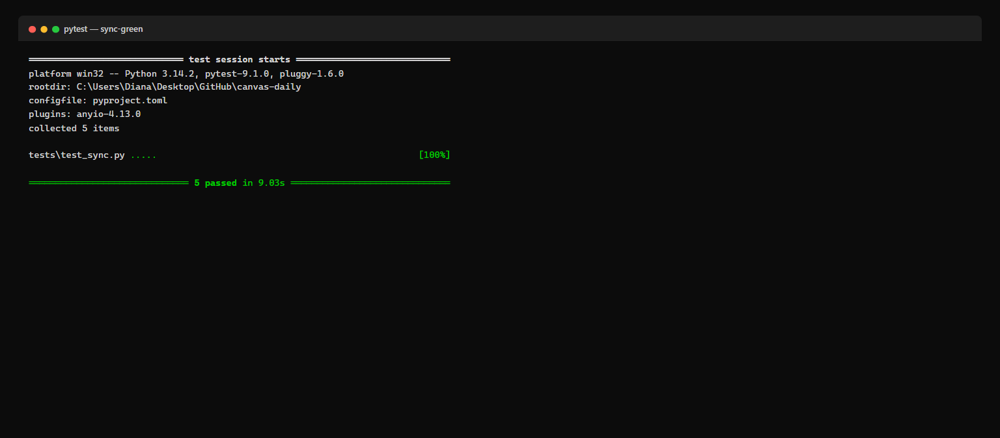

**Layer 7 — daily email (SMTP mocked)**

One plain-text email per user, merging every assignment across all their connections — grouped Past due / Due today / Upcoming, sorted by due date, each item labeled by its connection. Summary only (names, dates, labels), so **the access token never appears in the body**. SMTP is injected and faked in tests — no mail is actually sent.

Red — the mailer module doesn't exist yet:

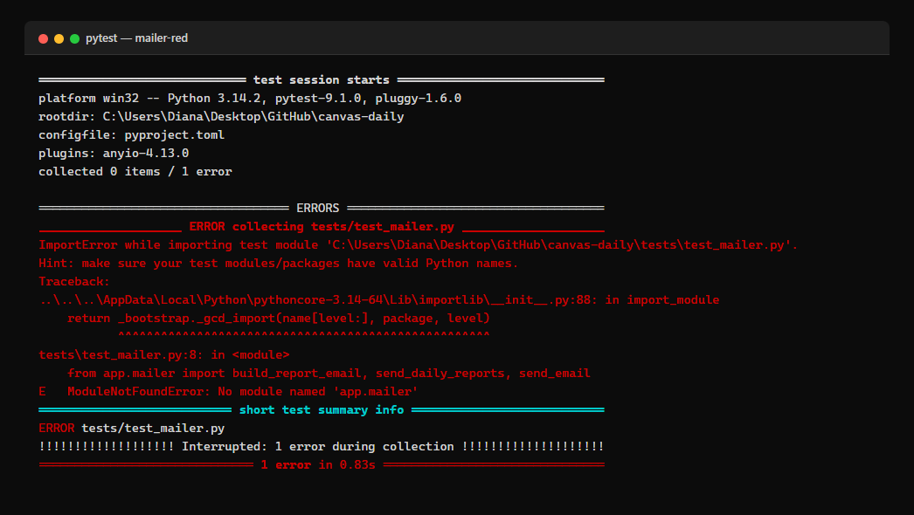

Green — after writing `build_report_email`, `send_email`, and `send_daily_reports`:


**Layer 8 — HTMX breakdown swap (Groq mocked)**

The AI breakdown swaps in place on the detail page instead of navigating to a separate page. An HTMX request (the `HX-Request` header) to the breakdown route returns just the result fragment — success markdown, or the timeout/error notice — with no site chrome; a normal POST still returns the full page, so the existing click-through keeps working. Groq is mocked; the AI logic is untouched.

Red — the route still returns the full page even for an HTMX request:

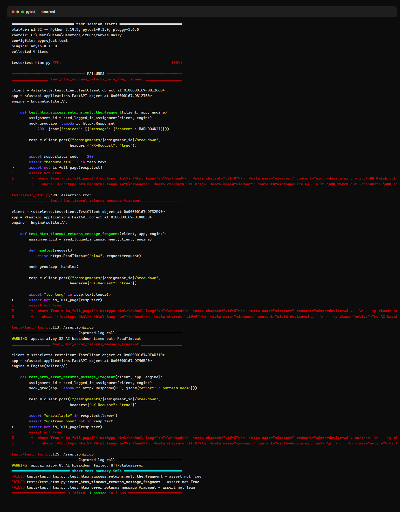

Green — after splitting the fragment out and returning it on `HX-Request`:

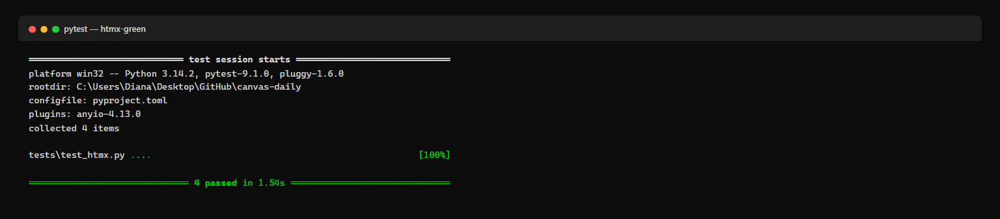

**Layer 9 — accounts list + sync stamping (Canvas mocked, Neon test branch)**

The settings screen as a real accounts list, and the sync stamp it surfaces. Six behaviors: a successful sync **stamps `last_synced_at`** (what the list shows); the settings screen **lists accounts**; an **empty state** when there are none; a **"Sync failed" badge** when a connection's last sync errored; **removing** a connection cascades to its assignments; and a user **cannot remove another user's** connection. Canvas is mocked at the httpx boundary; the web flow runs through a real TestClient against the Neon test branch. (Adding a connection and its background sync is Layer 10.)

Red — the accounts feature doesn't exist yet, so the test module can't even import:

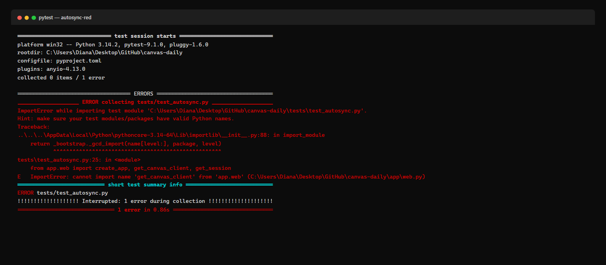

Green — after writing the accounts list, the `last_synced_at` stamp, the sync-failed badge, and the remove route:

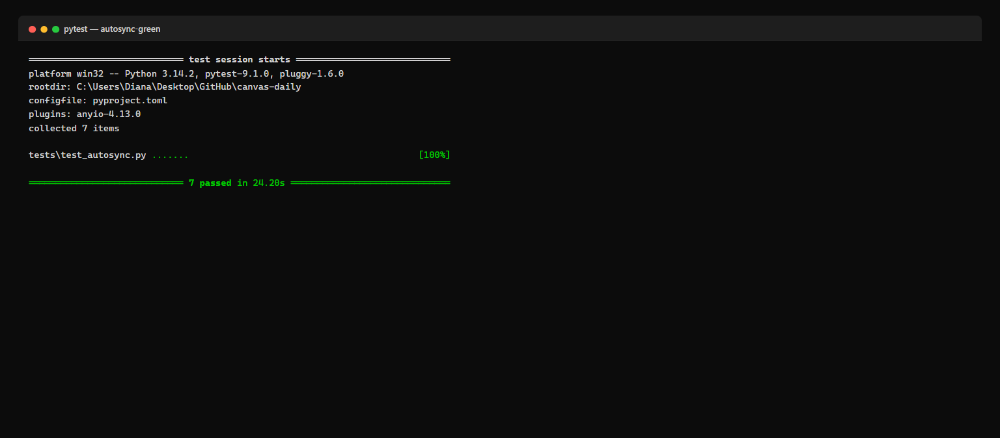

**Layer 10 — background sync + account setup page (Canvas mocked, Neon test branch)**

Adding a connection no longer freezes on a synchronous fetch: the connection is saved, the sync runs in a **background task**, and you land on a **setup page** that polls until it's done. Nine behaviors: a new connection defaults to **`pending`**; the background sync **stores assignments and marks `ok`**; a failed background sync **keeps the connection and marks `error`** (token-free log); adding a connection **redirects to the setup page**; assignments **appear on the dashboard once the background sync finishes**; a failed add still **persists with `error`**; the **status endpoint** reports the state as JSON; the **setup page renders, then redirects** once status is `ok`; and a user **cannot view another user's** setup page or status. Canvas is mocked at the httpx boundary; the flow runs through a real TestClient (which runs background tasks) against the Neon test branch.

Red — the background sync, setup page, and status endpoint don't exist yet, so the test module can't even import:

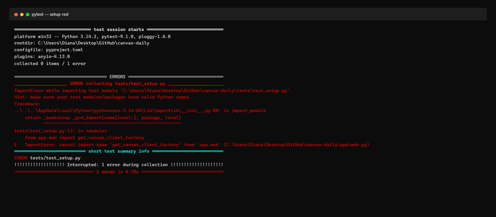

Green — after writing the background sync, the `sync_status` column, the setup page + poller, and the status endpoint:

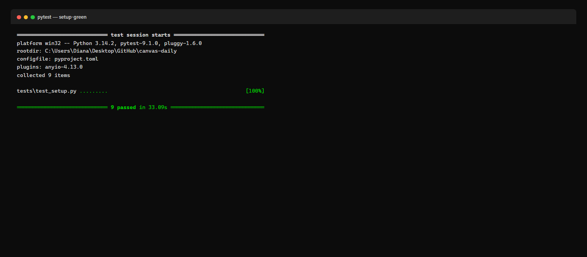

**Layer 11 — completed work in its own section (Neon test branch + TestClient)**

Done work no longer clutters the urgency columns. `report_for_user` routes anything **submitted, graded, or excused** into its own `completed` bucket (a **missing** past-due item is *not* done and stays in Past due). The dashboard shows completed work in a collapsible **`<details>` "Completed (N)"** section — read-only, **no detail page and no AI breakdown** — and the daily email drops completed work (and stops counting it in the subject total). Eight behaviors: submitted/graded/excused → `completed`; missing stays `past_due`; not-done due-today stays put; the completed item is **separated from the board and carries no `/assignments/{id}` link**; the disclosure shows the right count; no disclosure when nothing's done; and the email excludes completed from body and total.

Red — the `completed` bucket, the dashboard disclosure, and the email fix don't exist yet, so the bucketing assertions hit `KeyError: 'completed'`:

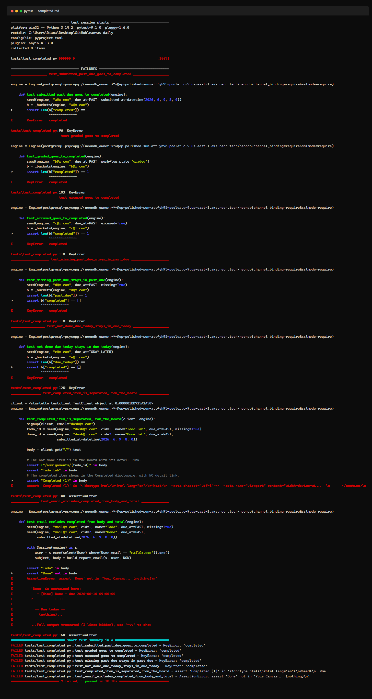

Green — after adding the `completed` bucket, the dashboard disclosure, and the email total fix:

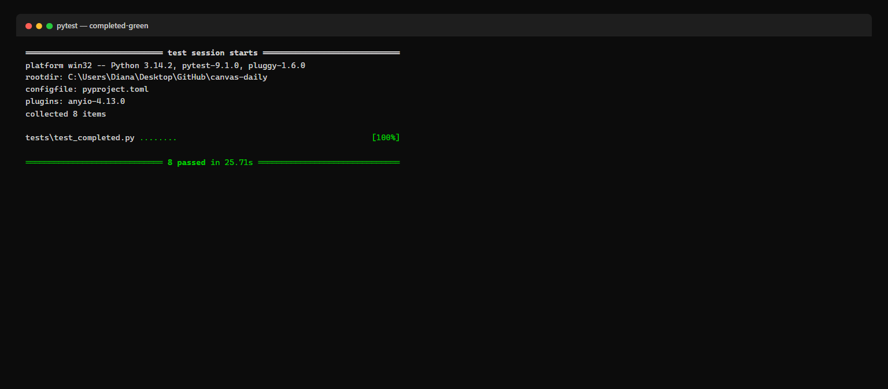

**Layer 12 — redesigned AI breakdown: structured sections + modal cards**

The "Break this down with AI" trigger moves to the top of the detail page beside "Open in Canvas". Groq is now asked for a **JSON object** with four sections — **What's being asked / Where to start researching / Outline of the work / Ideas & angles** — capped under 500 words, with the research section forbidden from inventing citations or URLs. The result renders as **styled cards in a modal** (no more raw markdown scrolled to the bottom), with a **copy-to-clipboard** button for pasting into a document. Bad JSON from the model degrades to the same clean error path as a timeout. Model text lands only in auto-escaped Jinja nodes, so no raw HTML reaches the page.

Red — `build_section_messages`, `generate_sections`, `SECTION_KEYS`, and the card/dialog markup don't exist yet, so the layer can't even import:

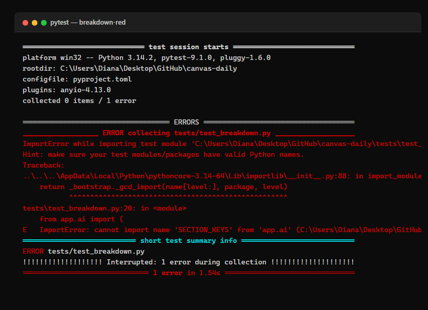

Green — after adding JSON-mode generation, parsing into four sections, and the card/dialog rendering:


**Layer 13 — AI breakdown sections as JSON arrays (bullets)**

Layer 12 asked Groq for a JSON object whose values were multi-line bulleted *strings*. On real, longer assignments the model emitted bare unquoted dash-lines that aren't valid JSON, so Groq's strict `json_object` validator returned **400** and the page showed a **502**. This layer adds `generate_bullets`, which asks Groq for each section as a JSON **array of strings** — a shape the model reliably encodes as valid JSON — and returns each section as a clean list of bullets. A stray string value is coerced into bullets instead of crashing, and the breakdown route renders one card bullet per array item.

Red — `build_bullet_messages` and `generate_bullets` don't exist yet, so the layer can't even import:

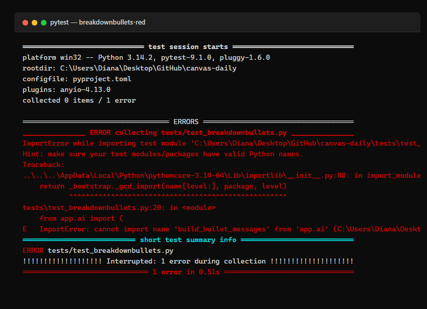

Green — after adding the array-based prompt, array parsing, and string-to-bullet coercion:

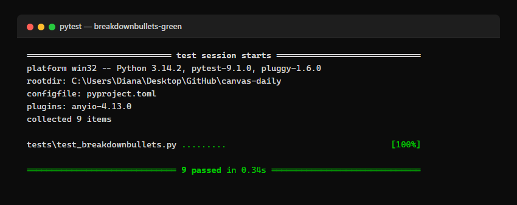

**Layer 14 — quiz indicator**

Some Canvas assignments are quizzes, and Canvas usually leaves the assignment description blank (the questions live on a separate quiz object), so quizzes showed an empty Instructions panel with nothing to identify them. `Assignment.is_quiz` reads the stored `online_quiz` submission type, and every surface labels quizzes from it: a **Quiz** pill and a quiz-specific message on the detail page, a **Quiz** tag on dashboard cards, and a `(Quiz)` marker in the daily email. There's **no AI breakdown for quizzes** — the button and modal are hidden, and the breakdown route refuses a quiz outright (defense in depth, so a direct POST can't run one either).

Red — `Assignment.is_quiz` and the quiz markup/markers don't exist yet:

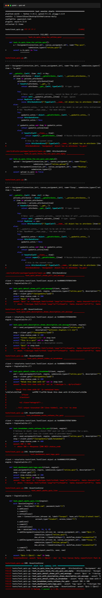

Green — after adding the property and the detail/dashboard/email labels:

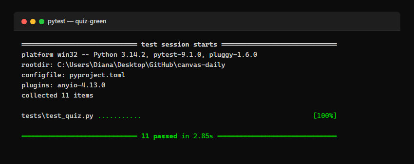

**Layer 15 — class (course code) on the card**

A dashboard card showed the connection label (the account name) but not which class the assignment was for. `fetch_courses` now also returns each course's `course_code`, the sync job stores it on the assignment as `course_code`, and the card shows it as a small class line under the title (e.g. **BIO 101**) — omitted when a course has no code. The connection-label pill is unchanged.

Red — `Assignment.course_code`, the fetch key, the sync write, and the card markup don't exist yet:

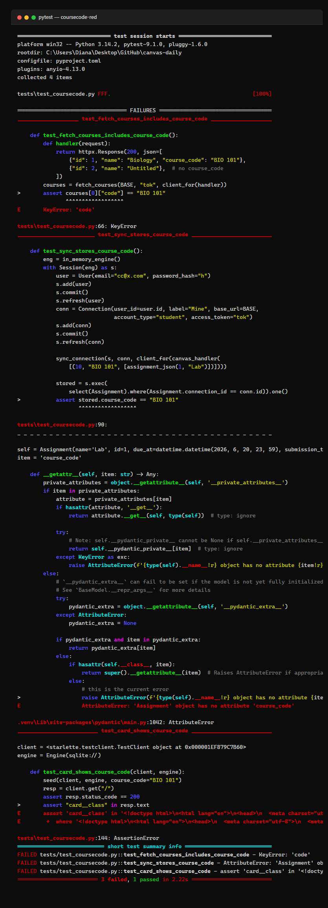

Green — after adding the column, the fetch key, the sync write, and the card line:

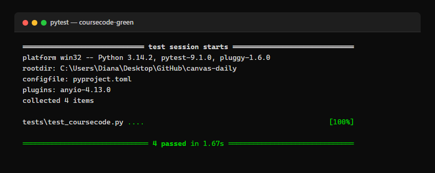

**Layer 16 — guard null submission flags**

Canvas can return a submission with `late`, `missing`, or `excused` as explicit JSON `null` (not just absent). `_parse` used `submission.get(key, False)`, which only defaults when the key is *missing* — a present `null` passed `None` straight through, and those assignment columns are `NOT NULL`, so the daily sync hit an integrity violation and rolled back, storing nothing (which also blocked the course-code backfill). The fix coerces null flags to `False`.

Red — `_parse` lets a null flag through as `None`:

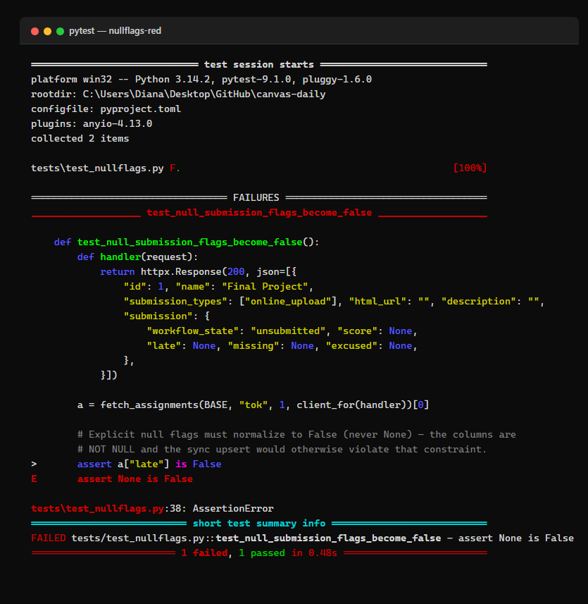

Green — after coercing null `late`/`missing`/`excused` to `False`:


**Layer 17 — class label: short code on detail, trimmed on card**

The stored `course_code` is verbose (`CSA250 Intro Artificial Intelligence (22255)`). Two pure properties clean it up: `course_short` (leading token, `CSA250`) and `course_trimmed` (drops the trailing `(22255)`). The detail page header pill now shows the short code instead of the redundant connection label (the Connection metacard stays), and the dashboard card shows the trimmed course string.

Red — `course_short` / `course_trimmed` and the markup that uses them don't exist yet:

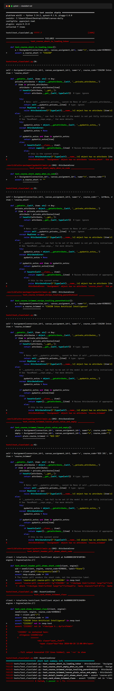

Green — after adding the properties and updating the pill and card:


**Layer 18 — group the Upcoming column by week**

The Upcoming column could hold many weeks of assignments, making the board tall and pushing the Completed section far down. `group_by_week` buckets upcoming work into Monday-start calendar weeks ("This week" / "Next week" / "Week of Jun 30"), skipping empty weeks, and the dashboard renders each week as a collapsible disclosure (first open) — so the column stays short and Completed is reachable.

Red — `group_by_week` and the weekly markup don't exist yet:

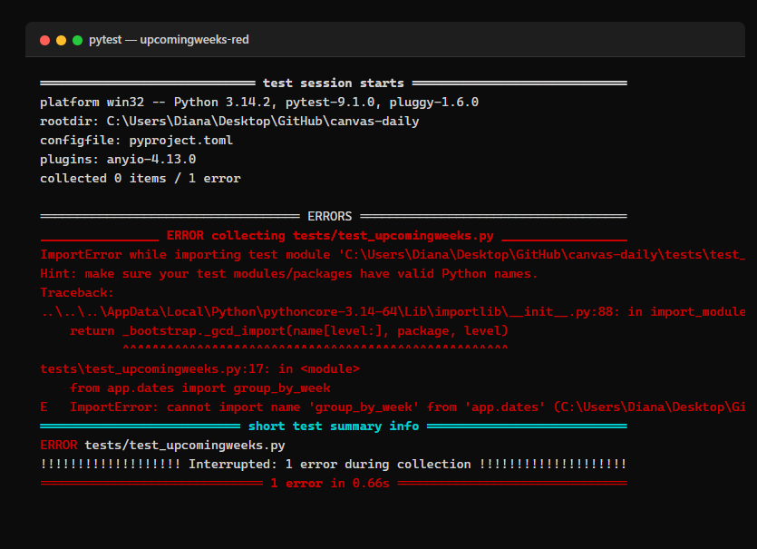

Green — after adding the grouping function and the weekly disclosures:


**Layer 19 — show due dates in the course's timezone**

Canvas returns due dates in UTC (`2026-06-20T06:59:59Z`), so an assignment Canvas shows as *Jun 19 by 11:59pm* (Arizona) appeared as the next morning at 6:59. Each Canvas course also carries its `time_zone`, so we store it on the assignment and convert: `to_local` turns the UTC moment into the course's zone, `due_display` formats it (`Jun 19, 2026 · 11:59 PM`), and the detail page, cards, email, and the Due-today/Upcoming bucketing all use local time. Storage stays UTC; an empty zone falls back to UTC.

Red — `to_local`, the `time_zone` field, and `due_display` don't exist yet:

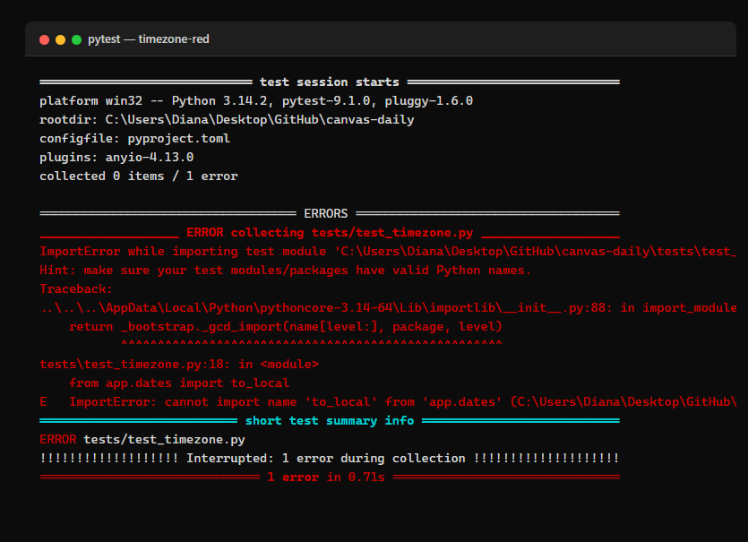

Green — after converting UTC to the course timezone for display and bucketing:


**Layer 20 — responsive top-nav (hamburger)**

The top bar had no responsive behavior, so on a phone the desktop nav showed as-is and (with the bigger logo) overflowed. A hamburger toggle now appears below 720px and drops the Dashboard / Account / Log out links into a panel below the bar; at 720px and up the nav stays inline as before. The toggle is a real `<button>` with `aria-expanded`, flipped by a few lines of vanilla JS.

Red — the toggle button and wired nav don't exist yet:

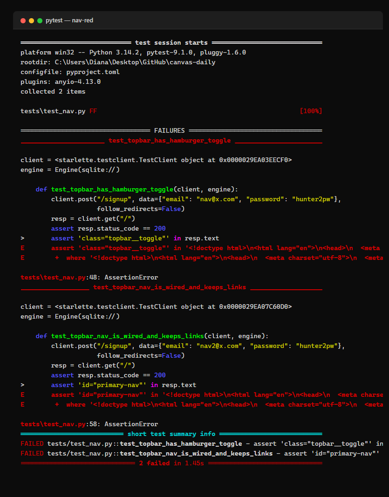

Green — after adding the toggle, the dropdown CSS, and the JS:


**Layer 21 — resilient DB pool (no stale-connection 500s)**

Neon (serverless Postgres) closes idle connections, so after the app sat idle the pool would hand a request a dead connection — an "Internal Server Error" that a refresh "fixed" (because SQLAlchemy then swapped in a fresh one). The engine now uses `pool_pre_ping=True` (check a connection is alive before using it, transparently replacing dead ones) and `pool_recycle=300` (retire connections older than 5 minutes). These tests pin both settings on the engine `make_engine` builds.

Red — the engine has no pre-ping or recycle (defaults: off / -1):

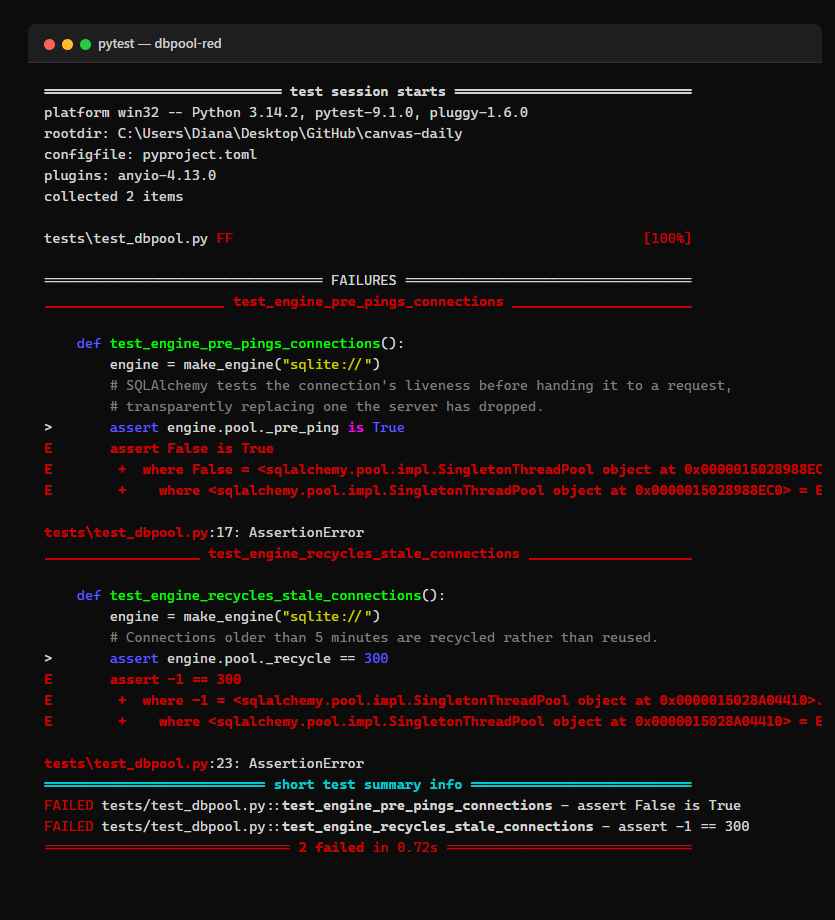

Green — after enabling pre-ping and recycle:

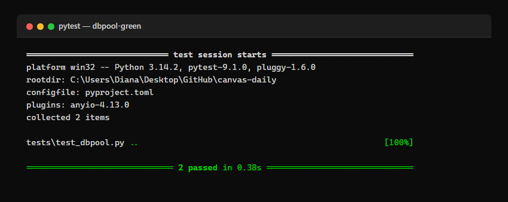

**Layer 22 — branded HTML daily report email**

The daily email was plain text. It's now a branded HTML email (with a plain-text fallback): the hosted logo, the date, the Past due / Due today / Upcoming sections, and each assignment as a card whose **name links to its Canvas Daily detail page**, with the class code, local due time, a status pill, and a Quiz tag. `build_report_html` renders a Jinja email template (status/pill data precomputed in Python); `send_email` gained an HTML alternative. The plain-text `build_report_email` is unchanged, so the `mailer` layer is untouched.

Red — `build_report_html` and the `html=` alternative don't exist yet:


Green — after rendering the HTML email and adding the multipart send:

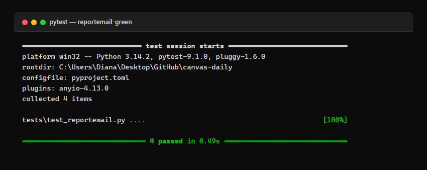

**Layer 23 — verify the Canvas token at entry**

Adding a connection used to accept any string as an access token, store it, and only discover a bad token in the background sync — the user just saw a spinner settle into a generic failure, with no hint that the *token* was the problem. Now `add_connection` probes Canvas (`GET /api/v1/users/self`) before saving anything: a rejected token (401/403) re-renders the form with "Canvas rejected this access token…" and saves nothing; an unreachable Canvas gets its own message; a valid token saves and syncs exactly as before. `verify_token` returns `ok` / `invalid` / `unreachable`, and never logs the token.

Red — `verify_token` doesn't exist yet:

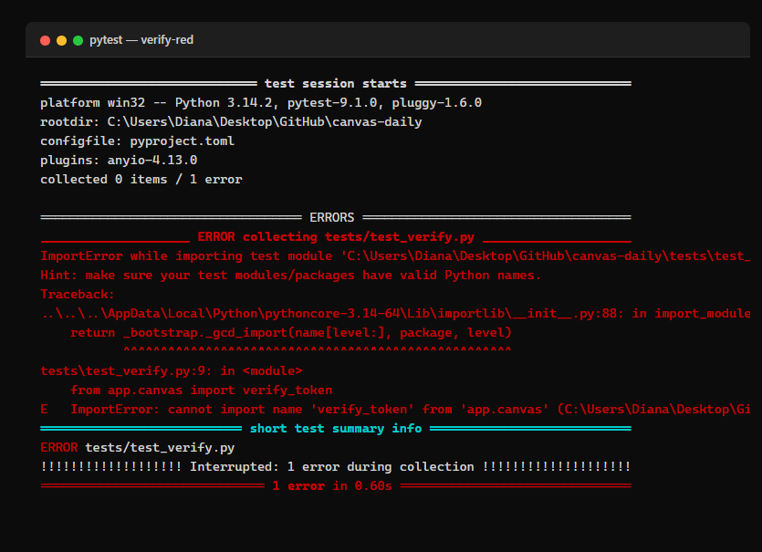

Green — after adding `verify_token` and the entry-time check:


**Layer 24 — email the user when a connection's token breaks**

A Canvas token can stop working after it was added (revoked, expired, regenerated). The daily sync had no per-connection error handling — the first 401 aborted the whole run, and nobody was told. Now `run_daily_sync` marks each connection ok/error independently (one bad token no longer stops everyone's fetch) and returns the connections that *newly* broke on a token rejection; `jobs.run_sync` emails each owner once — branded like the daily report — with steps to issue a new token. Outages and already-broken connections don't trigger it, and the token never appears in the email.

Red — `run_daily_sync` doesn't return broken connections and `build_token_error_email` doesn't exist:

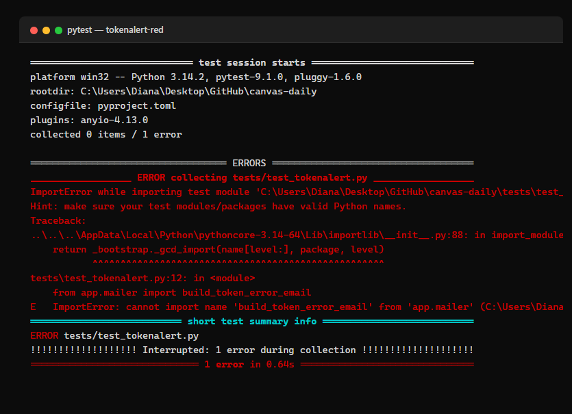

Green — after adding per-connection resilience and the branded alert email:


How these are made: `python tools/run_to_html.py <label> <pytest target>` runs pytest with color forced on and renders the output to a terminal-styled HTML page; a headless browser screenshots that page to a PNG. Same command for every layer, so red and green get documented as we go.

## Environment variables

All config comes from the environment — nothing is hardcoded. In local dev these are read from a `.env` file (loaded automatically); in production they're injected by the host. `.env` is never committed.

| Variable | Required | What it does |
| --- | --- | --- |
| `DATABASE_URL` | **Yes** | Connection string for the app's own Postgres (Neon). Used by the web app and both daily jobs. The jobs refuse to run if it's unset. Local dev may point this at a SQLite file instead. |
| `TOKEN_ENCRYPTION_KEY` | **Yes** | Fernet key that encrypts/decrypts Canvas access tokens at rest. Tokens are only ever stored as ciphertext; without this key they can't be read or written. |
| `GROQ_API_KEY` | **Yes** | Key for the Groq / Llama 3.3 service that generates the on-demand AI study breakdown. Read when the button is pressed — never logged or committed. |
| `SESSION_SECRET` | Prod | Signs login session cookies. Falls back to an insecure dev default if unset — must be a real secret in production. |
| `SMTP_HOST` | Email job | Mail server hostname. The email job refuses to run without it. |
| `SMTP_PORT` | No | Mail server port. Defaults to `587`. |
| `SMTP_USERNAME` / `SMTP_PASSWORD` | Email job | Mail server login. If both are set the job authenticates; if absent it connects without auth. |
| `SMTP_FROM` | No | "From" address on the daily email. Falls back to `SMTP_USERNAME`. |
| `TEST_DATABASE_URL` | Tests | Points the integration/E2E tests at a throwaway Postgres branch — never production. Those tests skip cleanly when it's unset. |

## Running the daily jobs

Two cron entry points wire the tested cores to real resources (DB session, HTTP client, SMTP). They read config from the environment and run nothing locally by accident — `DATABASE_URL` must point at production, not the test branch.

```
python -m app.jobs sync    # fetch + store every connection's assignments
python -m app.jobs email   # send each user their grouped daily report
```

Example crontab (UTC):

```
0 6 * * *  cd /app && python -m app.jobs sync
0 7 * * *  cd /app && python -m app.jobs email
```

The email job also needs `SMTP_HOST` / `SMTP_PORT` / `SMTP_USERNAME` / `SMTP_PASSWORD` / `SMTP_FROM`.

## Security

- Access tokens are **encrypted at rest** — never stored, printed, or logged in plaintext.
- The Groq key is read from `GROQ_API_KEY` in the environment — never hardcoded, never logged, never committed.
- Canvas `description` HTML is sanitized before it touches a page or email.
- `.env`, tokens, and secrets are never committed.

## Project docs

- **[SPRINT.md](SPRINT.md)** — the Phase 2 sprint spec: goal, user stories, acceptance criteria, specifications, TDD plan, build order, and definition of done.
- **[CLAUDE.md](CLAUDE.md)** — context and working rules for this repo.

---

**Owner:** Diana Busch · Next Chapter Cohort, Phase 2
